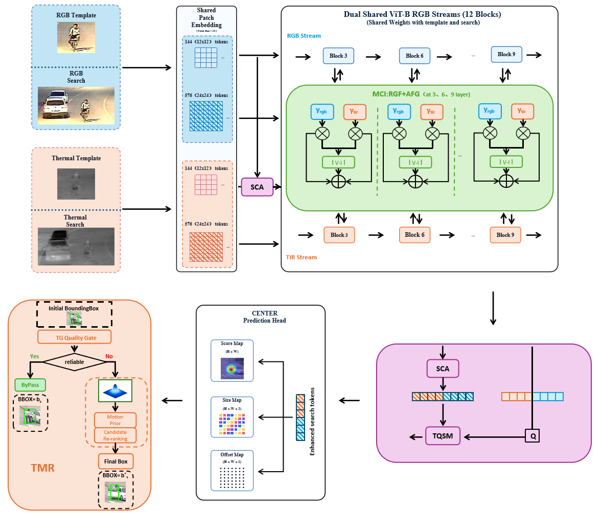
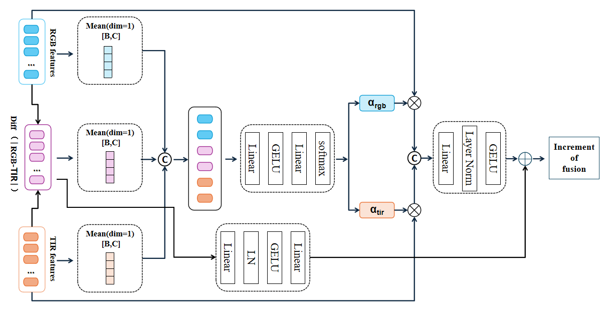
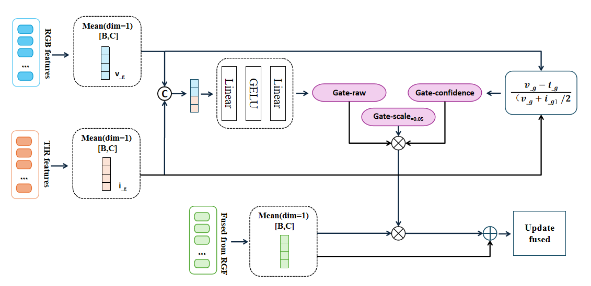
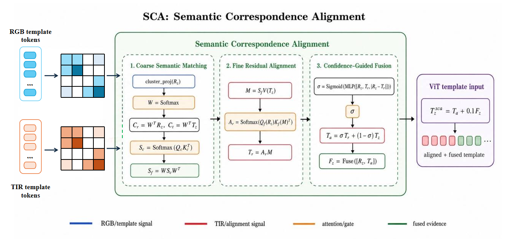
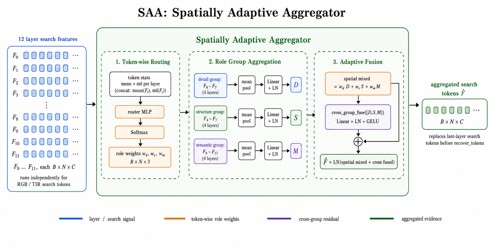
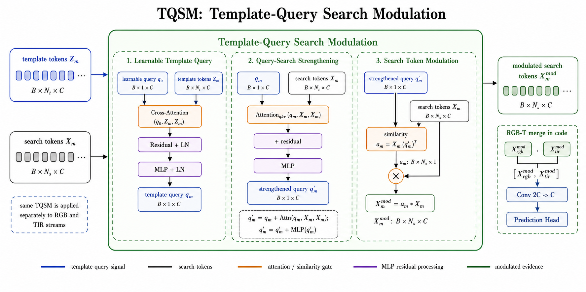
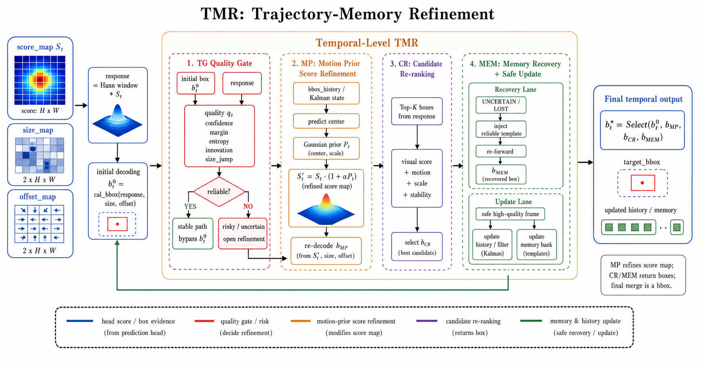
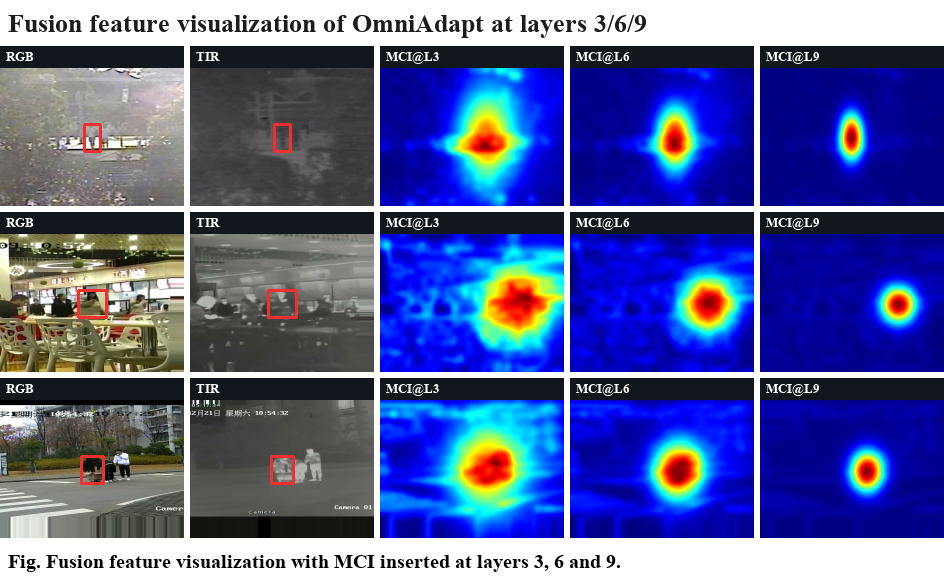
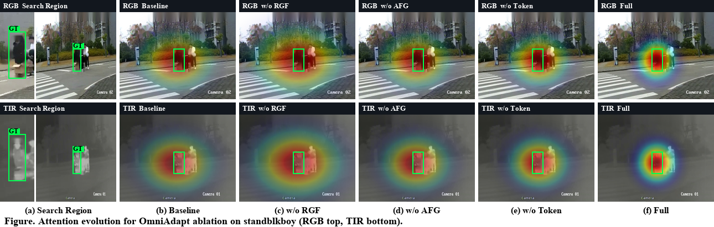

# OmniAdapt: Omni-Granularity Adaptive RGB-T Object Tracking

OmniAdapt is a research framework for visible-thermal, or RGB-T, single-object tracking. Built on a dual-modality ViT-B/16 backbone, it organizes uncertainty in RGB-T tracking into four progressive levels: **sample-level, channel-level, token-level, and temporal-level** adaptation. The corresponding adaptive processing is applied during both training and inference.

This repository provides training, parallel testing, ablation configurations, visualization utilities, and existing checkpoints. It mainly supports the LasHeR, RGBT234, RGBT210, and GTOT datasets.

## Core Modules

- **RGF (Reliability-Guided Fusion)**: estimates the reliability and discrepancy of RGB and thermal modalities at the sample level, providing adaptive guidance for cross-modal fusion.
- **AFG (Adaptive Fusion Gate)**: calibrates fused features through channel-wise gates initialized close to identity mapping, enhancing effective responses while suppressing unreliable channels.
- **SCA / SAA / Template Query / CSS**: handles cross-modal semantic correspondence, template aggregation, spatial context selection, and target-related feature enhancement at the token level.
- **TCSR (Trajectory-Conditioned Score Refinement)**: an optional inference-time trajectory prior that conservatively refines response maps under low confidence or motion interference.
- **Template memory bank**: an optional inference-time historical template mechanism for mitigating occlusion, drift, and appearance variation.

## Method Framework and Visualizations

### Overall Framework



### Sample-Level Reliability-Guided Fusion (RGF)



### Channel-Level Adaptive Fusion Gate (AFG)



### Semantic Correspondence Alignment (SCA)



### Spatial Adaptive Aggregation (SAA)



### Template Query Search Modulation (TQSM)



### Temporal Memory Refinement (TMR)



### Fused Feature Heatmaps



### Ablation Attention Heatmaps



## Project Structure

```text
OmniAdapt/
|-- assets/figures/            # Framework, module, and heatmap figures used in the README
|-- experiments/omniadapt/      # YAML files for the full model, training stages, and ablations
|-- lib/
|   |-- models/omniadapt/       # ViT backbone and OmniAdapt tracking network
|   |-- models/layers/          # Fusion and token modules such as RGF, AFG, and SCA
|   |-- train/                  # Datasets, trainers, and training pipeline
|   `-- test/                   # Tracker and parameter loading
|-- tracking/                   # Training and testing entry points, plus local environment tools
|-- pretrain/                   # User-provided pretrained weights
|-- output/                     # Checkpoints, test results, and visualization outputs
|-- scripts/                    # Bash and PowerShell scripts for installation, setup, training, and testing
`-- requirements.txt            # Python dependencies other than PyTorch
```

## Environment Setup

The fully self-checked reference environment is Python 3.12.7, PyTorch 2.5.1, torchvision 0.20.1, CUDA 12.1, and an NVIDIA GPU. To minimize version differences, using the same combination is recommended. For other CUDA versions, select the matching build from the official PyTorch installation page. Create a Conda environment first, then install PyTorch and the remaining pinned dependencies:

```bash
conda create -n omniadapt python=3.12
conda activate omniadapt

# Verified CUDA 12.1 combination
pip install torch==2.5.1 torchvision==0.20.1 --index-url https://download.pytorch.org/whl/cu121

# Install the remaining dependencies listed in requirements.txt
bash scripts/install.sh
```

On Windows PowerShell, loosen the script execution policy for the current session before running the installer:

```powershell
Set-ExecutionPolicy -Scope Process Bypass
.\scripts\Install.ps1
```

Before running from the repository root, configure the project and dataset paths. The following example applies to Linux / WSL:

```bash
export OMNIADAPT_ROOT="$(pwd)"
export LASHER_ROOT="/path/to/lasher"
# Optional: common parent directory for other datasets
export DATA_ROOT="/path/to/data"
```

The equivalent PowerShell commands are:

```powershell
$env:OMNIADAPT_ROOT = (Get-Location).Path
$env:LASHER_ROOT = 'D:\datasets\lasher'
$env:DATA_ROOT = 'D:\datasets'
```

> `OMNIADAPT_ROOT`, `LASHER_ROOT`, and `DATA_ROOT` are read by the training and testing environment configuration. You do not need to modify the default server paths in the source code.

When configuring local paths for training and testing for the first time, run:

```bash
bash scripts/setup_paths.sh /path/to/data output
```

This command generates local environment configuration files. `/path/to/data` should be the common parent directory of the dataset folders.

PowerShell equivalent:

```powershell
.\scripts\Setup-Paths.ps1 -DataDir 'D:\datasets' -SaveDir '.\output'
```

## Data Preparation

Training uses the LasHeR training set. By default, the expected layout is:

```text
<LASHER_ROOT>/
|-- trainingset/
|   `-- <sequence>/
|       |-- visible/
|       |-- infrared/
|       |-- init.txt
|       `-- visible.txt
`-- testingset/
    `-- <sequence>/
        |-- visible/
        |-- infrared/
        |-- init.txt
        `-- visible.txt
```

The testing script also supports the following datasets. Pass the root directory explicitly through `--data_root` to override the built-in paths:

| Argument | Image directories | Annotation file |
| --- | --- | --- |
| `lasher` | `visible/`, `infrared/` | `init.txt` for initialization and `visible.txt` for full annotations |
| `rgbt234` | `visible/`, `infrared/` | `groundTruth.txt` |
| `rgbt210` | `visible/`, `infrared/` | `init.txt` |
| `gtot` | `v/`, `i/` | `groundTruth_v.txt` |

`tracking/test.py` converts single-channel thermal images to three-channel inputs and concatenates RGB and TIR frames into six-channel data. GTOT annotations in `(x1, y1, x2, y2)` format are automatically converted to `(x, y, w, h)` during testing.

### Dataset and Evaluation Resources

Dataset downloads and usage must follow the license agreements of their respective publishers. The table below only links resource pages or official repositories maintained by the release teams. The entries for GTOT, RGBT210, and RGBT234 are maintained together by the Multimodal Intelligent Computing team at Anhui University.

| Resource | Dataset download | Official evaluation toolkit |
| --- | --- | --- |
| [GTOT](https://chenglongli.cn/_code-dataset/dataset) | [Official resource page](https://chenglongli.cn/_code-dataset/dataset) | [Official resource repository](https://github.com/mmic-lcl/Datasets-and-benchmark-code) |
| [RGBT210](https://chenglongli.cn/_code-dataset/dataset) | [Official resource page](https://chenglongli.cn/_code-dataset/dataset) | [Official resource repository](https://github.com/mmic-lcl/Datasets-and-benchmark-code) |
| [RGBT234](https://chenglongli.cn/_code-dataset/dataset) | [Official resource page](https://chenglongli.cn/_code-dataset/dataset) | [Official resource repository](https://github.com/mmic-lcl/Datasets-and-benchmark-code) |
| [LasHeR](https://github.com/BUGPLEASEOUT/LasHeR) | [Download section in the official repository](https://github.com/BUGPLEASEOUT/LasHeR#dataset) | [Official evaluation toolkit](https://pan.baidu.com/s/1LRIceZ62x5CHobpyZcGxEQ), extraction code: `mmic` |
| [VTUAV](https://zhang-pengyu.github.io/DUT-VTUAV/) | [Official project page](https://zhang-pengyu.github.io/DUT-VTUAV/) | [Official evaluation toolkit](https://drive.google.com/file/d/1B3609O1TUC9WIfNqevKK-OOlGGiJ11m0/view?usp=sharing) |

> The official resource page for RGBT234 and RGBT210 provides both Google Drive and Baidu Netdisk entries. The old Google Drive direct link for GTOT on that page is currently unavailable, so choose an accessible mirror from the official resource page. Do not rely on third-party repackaged or reposted versions.

## Experiment Configurations

Configuration files are located under `experiments/omniadapt/`. During training, pass the configuration name without the `.yaml` suffix.

| Configuration | Description |
| --- | --- |
| `std_full` | Standard full model with RGF, AFG, and token-level adaptive modules enabled. |
| `std_no_modules` | Baseline with RGF, AFG, and token adaptation disabled. |
| `std_wo_sample_rgf` | Ablation that removes sample-level RGF. |
| `std_wo_channel_afg` | Ablation that removes channel-level AFG. |
| `std_wo_token` | Ablation that removes token-level modules. |

The standard configuration uses a 128x128 template, a 256x256 search region, the AdamW optimizer, and a ViT-B/16 backbone. The pretrained file is specified by `MODEL.PRETRAIN_FILE`. Before training from scratch, download `DropTrack.pth.tar` yourself and place it under `pretrain/`. This file is not required when testing with an already trained OmniAdapt checkpoint.

## Training

The quick script arguments are `<config_name> <mode> <num_gpus>`. Run single-GPU training from the repository root:

```bash
bash scripts/train.sh std_full single 1
```

PowerShell equivalent:

```powershell
.\scripts\Train.ps1 -Config std_full -Mode single -NumGpus 1
```

Multi-GPU training example:

```bash
bash scripts/train.sh std_full multiple 4
```

```powershell
.\scripts\Train.ps1 -Config std_full -Mode multiple -NumGpus 4
```

Training artifacts are saved by default to:

```text
output/checkpoints/train/omniadapt/<config_name>/OmniAdapt_epXXXX.pth.tar
```

## Testing and Evaluation

`tracking/test.py` runs tracking in a multi-process manner, with each worker independently loading one model copy. The quick script arguments are `<checkpoint> <dataset> <data_root> [epoch] [workers] [config]`. It is recommended to validate the environment with one worker first, then increase the parallelism based on CPU memory and GPU memory. The following example evaluates epoch 12 of `std_full` on the LasHeR test set:

```bash
bash scripts/test.sh \
  /path/to/OmniAdapt_ep0012.pth.tar \
  lasher /path/to/lasher 12 1 std_full
```

```powershell
.\scripts\Test.ps1 `
  -Checkpoint 'D:\models\OmniAdapt_ep0012.pth.tar' `
  -Dataset lasher -DataRoot 'D:\datasets\lasher' -Epoch 12 -Workers 1 -Config std_full
```

To test on RGBT234, only replace the dataset name and path:

```bash
bash scripts/test.sh \
  /path/to/OmniAdapt_ep0012.pth.tar \
  rgbt234 /path/to/RGBT234 12 1 std_full
```

```powershell
.\scripts\Test.ps1 `
  -Checkpoint 'D:\models\OmniAdapt_ep0012.pth.tar' `
  -Dataset rgbt234 -DataRoot 'D:\datasets\RGBT234' -Epoch 12 -Workers 1 -Config std_full
```

After downloading weights, you can first run a reproduction smoke test that does not depend on any dataset. This command strictly checks all parameters between the checkpoint and configuration, then performs one forward pass with synthetic RGB-T input:

```bash
python tracking/smoke_test.py \
  --checkpoint /path/to/OmniAdapt_ep0012.pth.tar \
  --config std_full
```

The reference file information for reproducing the main results is listed below. When publishing files through netdisk storage, keep the file name and SHA-256 unchanged:

| File | Configuration | Epoch | Size (bytes) | SHA-256 |
| --- | --- | ---: | ---: | --- |
| `OmniAdapt_ep0012.pth.tar` | `std_full` | 12 | 1,735,365,334 | `B6D4E9DB8824A6572B2C6A99DD03D37A932494F12889928168AB5FF319DBB0B3` |

Use `Get-FileHash -Algorithm SHA256 <checkpoint>` in PowerShell or `sha256sum <checkpoint>` in Linux/WSL to verify the file. Only load checkpoints from trusted sources with matching hashes.

Optional inference-time enhancements:

```bash
# Enable TCSR trajectory-guided response-map refinement
python tracking/test.py ... --tcsr --tcsr_alpha 0.10 --tcsr_sigma 2.0

# Enable the template memory bank
python tracking/test.py ... --memory
```

Results are saved by default to `output/results/<dataset>/<yaml_name>_<epoch>/`. You can also specify another directory with `--save_dir`. Outputs include:

- text files containing predicted boxes for each sequence;
- `per_seq_metrics.csv`: per-sequence AO, SS, SR50, SR75, PS, NPS, and FPS;
- `summary.json`: sequence averages and frame-weighted averages;
- `eval_history.csv`: evaluation records across checkpoints.

> To ensure fair comparisons, TCSR and the template memory bank are optional inference-time modules. When reporting main results, explicitly state whether these options are enabled.

## Results and Model Downloads

Model weights, benchmark results, and per-sequence prediction files will be released through netdisk storage. Links and extraction codes have not been filled in yet.

| Resource | Netdisk link | Extraction code | Description |
| --- | --- | --- | --- |
| Full OmniAdapt model weights | TBD | TBD | Checkpoint for reproducing the main experimental results. |
| Pretrained weights | TBD | TBD | Pretrained model required before training. |
| Benchmark results | TBD | TBD | Results and per-sequence predictions on datasets such as LasHeR, RGBT234, RGBT210, and GTOT. |

## Paper and Citation

The manuscript title corresponding to this repository is:

```text
OmniAdapt: Omni-Granularity Adaptive Fusion for Robust RGB-T Tracking
```

| Item | Link / Information |
| --- | --- |
| Paper homepage or arXiv | TBD |
| DOI / publication information | TBD |
| Official BibTeX | TBD |

After the paper is officially released, this section will provide the authors, venue, year, page numbers, and a directly copyable BibTeX entry.

## License

This repository does not currently include an open-source license. Before public release, a license file will be selected and added according to the redistribution terms of the code, model weights, and datasets.

## Acknowledgements

This project uses PyTorch, timm, ViT/DropTrack pretrained models, and RGB-T tracking benchmarks. We thank the maintainers of these open-source projects and datasets for their contributions.
